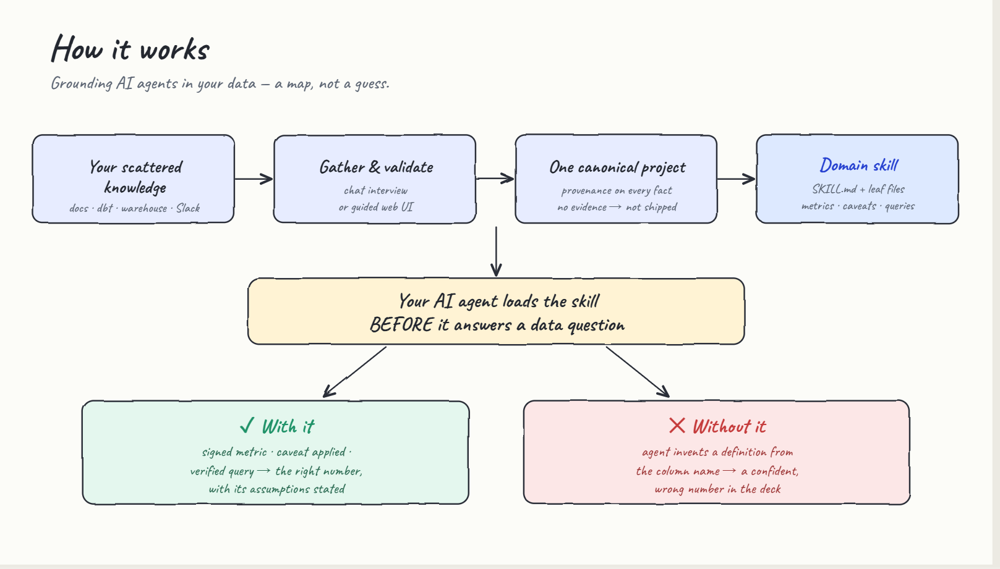
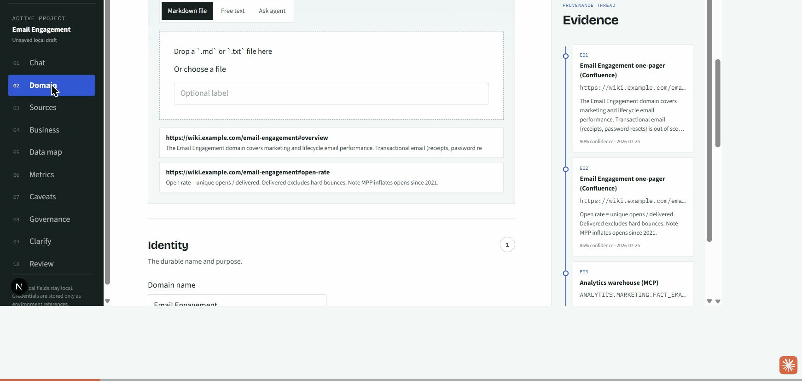
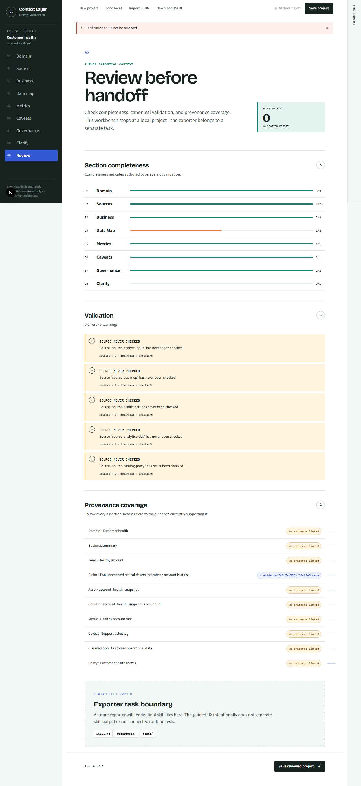

# Data Context Layer Studio

**Give your AI agents a governed, domain-true context layer — built by the data team, not guessed by the model.**

<p align="center">
  <a href="LICENSE"></a>
  
  
  <a href="#contributing"></a>
</p>

Data Context Layer Studio helps analytics and data teams turn scattered tribal knowledge (docs, warehouse MCPs, APIs, dbt) into a portable **Claude / Cursor domain skill** — a `SKILL.md` routing map plus leaf files an agent loads _before_ it answers a data question.

**Two ways to build it, same output** — pick whichever fits your team:

| Path | Best for | Start here |
| --- | --- | --- |
| 💬 **Conversational skill** | Teams who'd rather be interviewed in chat by Claude or Cursor | [Build it in conversation](#build-it-in-conversation) |
| 🖥️ **Workbench UI** | Analysts who want a guided visual checklist so nothing is skipped | [Quick start](#quick-start) |

Curious what the result looks like? See a finished (fictional) example: [`examples/subscription-usage/`](examples/subscription-usage/).

No hosted account. No telemetry. Credentials and MCP configs stay on your machine.

<p align="center">
  
</p>

<p align="center">
  <a href="#quick-start"><strong>Quick start</strong></a> ·
  <a href="#build-it-in-conversation"><strong>Build it in conversation</strong></a> ·
  <a href="#try-the-claude-code-build"><strong>Try Claude Code build</strong></a> ·
  <a href="#what-you-get"><strong>What you get</strong></a> ·
  <a href="#how-it-works"><strong>How it works</strong></a> ·
  <a href="#privacy"><strong>Privacy</strong></a> ·
  <a href="#contributing"><strong>Contributing</strong></a>
</p>

---

## Why this exists

AI coding agents are great at writing SQL and answering “what does this metric mean?” — until they invent a definition, join the wrong grain, or miss a known caveat.

Data teams already know the truth. It’s scattered across Slack threads, dbt docs, Snowflake tables, Notion pages, and tribal knowledge. This studio turns that knowledge into a **structured, reviewable skill pack** agents can load before they answer.

| Without a context layer | With Data Context Layer Studio |
| --- | --- |
| Agents reconstruct metrics from names | Metrics come from signed definitions |
| Schema guesses drift from the warehouse | Sources and evidence stay provenance-linked |
| Caveats live in someone’s head | Caveats travel with the answer path |
| Every domain is a one-off markdown dump | Every domain exports the same skill shape |
| Copy a template into Claude and hope nothing was skipped | Guided UI checklist, then Claude Code rewrites the skill |

---

## Quick start

**Requirements**

- Node.js 22+ and [pnpm](https://pnpm.io) via Corepack  
- Optional for polished export: [Claude Code](https://docs.anthropic.com/en/docs/claude-code) installed and logged in on **the same machine** that runs the app  

```sh
git clone https://github.com/nimrodfisher/data-context-layer-studio.git
cd data-context-layer-studio
corepack enable
corepack pnpm install
corepack pnpm dev
```

Open [http://localhost:3000](http://localhost:3000).

1. Start on **Chat** and answer where each piece of context lives  
2. Refine Domain → Sources → Business → Data → Metrics → Caveats → Governance (drop files, paste notes, or ask the agent per section)  
3. Run **Clarify** / **Review** until the Claude Code checklist is green  
4. Click **Build skill with Claude Code** — or **Download raw ZIP** if you only want the deterministic template fill  

### See it in action

<p align="center">
  
  <br />
  <sub>From interview to a reviewed, provenance-linked skill — one canonical model, exported to the skill file tree.</sub>
</p>

<p align="center">
  
</p>

---

## Build it in conversation

Prefer to be **interviewed** instead of filling in a UI? Open this repo in **Claude Code** or
**Cursor** and let the agent walk you through it. Same output as the UI — a polished skill folder.

1. Clone and install (the [Quick start](#quick-start) steps above), then open the folder in Claude
   Code or Cursor.
2. Invoke the onboarding skill — in Claude Code, run `/context-onboarding` (or just ask:
   *"help me build a context skill for my domain"*).
3. Answer a handful of short questions. The agent reads the docs and tables you point it at,
   captures evidence, and writes a `project.json`.
4. It runs one command to generate the skill, then polishes it:

   ```sh
   pnpm export:skill ./<your-domain>.project.json --out ./<your-domain>-skill
   ```

5. Drop the resulting `<your-domain>/` folder into your agent's skills directory.

The skill lives in [`.claude/skills/context-onboarding/`](.claude/skills/context-onboarding/) and
is written for non-technical analysts — short questions, plain language, nothing invented.

**Using Cursor?** Point Cursor at the same folder, or copy
`.claude/skills/context-onboarding/` into your Cursor skills/rules location. The steps are identical.

See a finished example (fictional) under [`examples/subscription-usage/`](examples/subscription-usage/)
— that's the quality bar the polish step aims at.

### Just the exporter

`pnpm export:skill` turns any canonical `project.json` into the skill file tree without the web
server — handy in scripts or CI:

```sh
pnpm export:skill project.json --out ./skill      # write the folder tree
pnpm export:skill project.json --zip              # write a <domain>-skill.zip
pnpm export:skill project.json --validate-only    # check it, write nothing
```

---

## Try the Claude Code build

Use this when you want Claude Code to **rewrite** the gathered context into a clear skill (not a dump into folders).

1. Confirm Claude Code works in a terminal on this machine:

   ```sh
   # Windows
   where claude

   # macOS / Linux
   which claude
   ```

   If that fails, install/login Claude Code, or set `CONTEXT_LAYER_CLAUDE_BIN` in `.env.local` (see [`.env.example`](.env.example)).

2. In the workbench, gather at least:

   - Domain name, real description, and a boundary / inclusion / exclusion  
   - One attached context piece (markdown file, paste, or source)  
   - Business summary, terms, claims, or goals  
   - One asset, metric, caveat, or recent update  

3. Open **Review** → complete the **Claude Code checklist** → **Build skill with Claude Code**.  
4. Wait for the job (builds under `.context-layer-data/builds/`), preview `SKILL.md` / overview, then **Download Claude skill ZIP**.  

**Note:** The Next.js server shells out to `claude -p`. Claude Code must be available to that process (same machine as `pnpm dev`), not only on another laptop.

Without Claude Code, **Download raw ZIP** still works.

---

## What you get

A downloadable ZIP with a domain skill folder shaped for agent runtimes:

```text
your-domain/
├── SKILL.md                 # Routing map + non-negotiables
├── POPULATING.md            # Checklist: how to finish the skill
├── guardrails.md            # SQL / tool safety rules
├── product_context/         # Overview, segments, lifecycle, glossary
├── data_context/
│   ├── metrics.yml
│   ├── caveats.md
│   ├── semantic_layer/      # _index.md + one <table>.yml per table
│   ├── table_profiling/     # _index.md, <table>.md per table, scripts/profile_table.sql
│   └── verified_queries/
└── recent_updates/          # Freshness + ingestion contract
```

Drop it into your agent skills directory (for example `.claude/skills/` or your Cursor skills location) and agents get a map, not an encyclopedia.

The conversational / polish path also writes two extra files: **`POPULATING.md`** (a plain checklist of what's left to finish the skill) and **`GOVERNANCE.md`** (suggested routines — freshness checks, update syncs, metric sign-off). See both in [`examples/subscription-usage/`](examples/subscription-usage/).

---

## How it works

The [diagram at the top](#data-context-layer-studio) shows the end-to-end flow: your scattered
knowledge → gather &amp; validate → one **canonical project** (provenance on every fact) → a
**domain skill** → the agent loads it *before* it answers. Two ways to author, one output:

```text
Author the context — pick one, same result:
  • Web workbench          (guided visual checklist)
  • Conversational skill    (Claude/Cursor interviews you)
        │
        ▼
  Canonical project.json (local validate · clarify · save/load)
        │
        ├─► pnpm export:skill           → deterministic skill tree / ZIP (no LLM)
        └─► Claude Code build / polish  → claude -p → polished skill
```

### Chat + MCP connectors

On startup, Chat discovers MCP servers from your Cursor environment (`~/.cursor/mcp.json` and the local Cursor project catalog).

Try messages like:

- `list connectors`
- `list tools for github`
- `use github to search repositories`

Secrets in MCP configs are used **server-side only** and never written into the exported skill. Prefer environment-variable references over inline tokens in `mcp.json`.

### Forms when you need precision

Every section supports the same three moves: drop markdown, paste free text, or ask the in-app agent to draft from attached context. Refine ownership, grain, and caveats in the forms when you need precision.

### Clarification before Claude Code builds the skill

Deterministic validation flags missing ownership, grain, dangling references, unsupported claims, and freshness issues. Resolve them in **Clarify**, complete the Review checklist, then **Build skill with Claude Code**. The app writes a local pack under `.context-layer-data/builds/` and runs your installed Claude Code CLI to produce the polished skill.

---

## Privacy

Designed for data teams that cannot send warehouse context to a SaaS:

- Runs locally (Node command or Docker)
- No required login, database, or telemetry
- Project files stay under a local workspace (default `.context-layer-data/`)
- Credential values are redacted from exports and API responses
- Optional in-app drafting goes only to the OpenAI-compatible endpoint **you** configure
- Skill polish uses **Claude Code on your machine**, not a hosted studio LLM

---

## Architecture

pnpm TypeScript monorepo:

| Package | Role |
| --- | --- |
| `apps/web` | Next.js Lineage Workbench UI + local APIs |
| `packages/core` | Canonical model, validation, persistence |
| `packages/sources` | Static / MCP / REST / dbt adapters |
| `packages/agent` | Grounded drafting and clarification |
| `packages/exporters` | Skill file generation + ZIP + the `export:skill` CLI |
| `.claude/skills/context-onboarding` | The conversational onboarding skill |

`pnpm export:skill <project.json> [--out <dir> \| --zip \| --validate-only]` renders a canonical project into the skill tree from the terminal — no web server required.

```sh
corepack pnpm test        # unit tests
corepack pnpm typecheck
corepack pnpm build
corepack pnpm test:e2e    # Playwright (optional)
```

Docker:

```sh
docker compose up --build
```

---

## Extending sources

Adapters normalize everything into the same evidence shape (locator, retrieved time, confidence, excerpt, provenance).

- **Static** — markdown, text, JSON, YAML, CSV, SQL  
- **MCP** — configured servers from your coding environment  
- **API** — read-only HTTP with credential references  
- **dbt** — optional manifest/catalog import  

Want a new connector? Start from `packages/sources` and register it with the adapter registry.

---

## Roadmap

- [x] Local workbench + canonical model  
- [x] Chat onboarding + Cursor MCP discovery  
- [x] Per-section file / paste / agent ingest  
- [x] Skill ZIP export matching the domain template  
- [x] Claude Code handoff (checklist → build pack → `claude -p` → polished ZIP)  
- [x] **Conversational onboarding skill** — Claude/Cursor interviews the analyst and builds the skill in chat (same output shape as the UI)  
- [ ] Connected skill testing (ask business questions, inspect traces)  
- [ ] Richer live MCP auth flows (OAuth-backed servers)  
- [ ] Contributor docs, examples pack, and release automation  

Ideas and bugs welcome — open an issue or PR.

---

## Contributing

1. Fork and clone the repo  
2. `corepack pnpm install`  
3. Make a focused change with tests where behavior changes  
4. `corepack pnpm test && corepack pnpm lint && corepack pnpm typecheck`  
5. Open a pull request with the why, not just the what  

Good first contributions: sample domain fixtures, clearer empty states, connector docs, and README walkthroughs from real data-team setups.

---

## License

[MIT](LICENSE) © 2026 Nimrod Fisher

---

<p align="center">
  <sub>Built for data teams who want agents that answer with context — not confidence.</sub>
</p>
